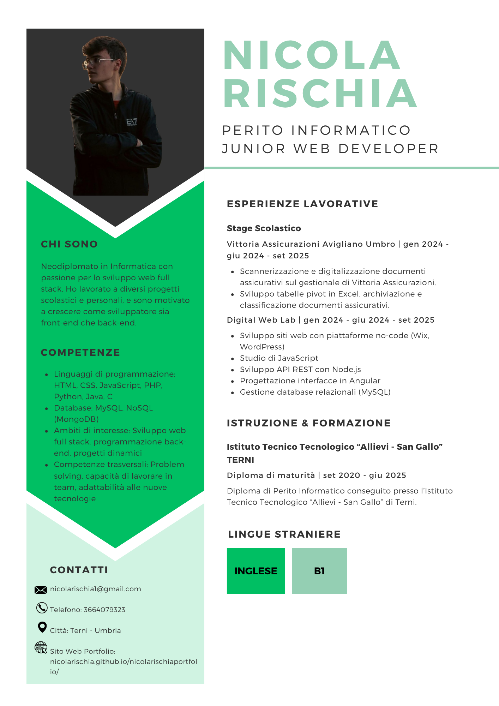

# Hi there 👋

I'm **Nicola Rischia**, an Italian IT student with a strong foundation in backend development, frontend technologies, networking, web design, and programming fundamentals.

## 💼 Skills & Technologies

### 🖥️ Backend Development
- 🟨 **Node.js** with **Express.js**
- 🍃 **MongoDB** NoSQL Databases
- 🧩 **EasyPHP** SQL Databases
- 🐍 **Python** (general programming, scripting)

### 🎨 Frontend Development
- ⚛️ **React** with **Vite**
- 🅰️ **Angular** and **Angular Material**
- 🌟 **HTML**, **CSS**, **JavaScript** (base)

### 💻 Programming Languages & Concepts
- ⚙️ **C** (concurrent programming)
- ☕ **Java** (object-oriented programming, Swing GUI)

### 🌐 Networking
- 🛜 **Cisco Packet Tracer** (basic routing, switching, subnetting)

### 🌍 Website Building
- 🧱 **Wix** (no-code/low-code web design)

### 📃 Forms and Data
- 📝 **Jotform** for dynamic and responsive form creation
- 📊 **Airtable** for structured data management and form integration

---

🔗 [My website](https://nicolarischia.github.io/nicolarischiaportfolio/)
